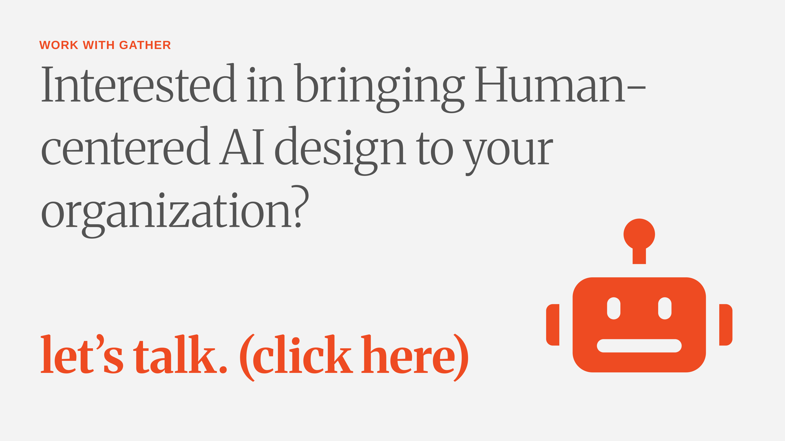

```
   .------------------------------------------------.
   | retro-bot says: "Always leave things better    |
   | than you found them!"                          |
   '------------------------------------------------'
        \
         |
        [■]
    .----------.
    |[══]  [══]|
    |          |
    | .------. |
    | |======| |
    '----------'
  .-------------.
  |             |
  | ✓  | ✗ | ↻ |
  |   retro-bot |
  '-------------'
      ||   ||
     _||   ||_
    [__]   [__]
```

# retro-bot

> *"Always leave things better than you found them."*

**An agile retrospective skill for your Claude collaboration sessions.**
Capture what you learned. Apply the fix. Make the next session better.

*Continuous improvement = continuous tokenmaxxing.*

[](#install)
[](./LICENSE)
[](https://claude.ai)

---

## How it fits into your workflow

You finish a Claude session — a document build, a data analysis, a code review, a content
draft, whatever the work was. Instead of closing the window and letting the friction
evaporate, you type:

> *"let's do a retro on that session"*

Ten minutes later: the fix is applied, the snapshot is saved, and the next session starts
smarter. That's it. retro-bot handles the rest.

---

## The problem

If you've worked in Agile, working with Claude should feel familiar. Especially as a
product owner, your core skill is articulating what you want built, and that maps
directly to getting great outputs from Claude. The clearer the brief, the better the
output. Same principle, different medium.

I've found one valuable element from Agile that was missing for me: the retrospective.

Retrospectives are the point of origination for iteration. It's where you clear the air,
get on the same page, align on what worked and what didn't, and commit to the specific
changes that carry those lessons forward. It invites self-reflection and a collective
approach to improvement. In a Claude workflow, its value can compound due to the more
rapid cycles of creation and iteration.

Without a deliberate improvement loop, every session carries the same overhead. You
re-establish context that should already be there. You hit the same friction you hit
last week. Learnings either evaporate or get dumped into one bloated file that creates
its own problems. Token budgets inflate. Output quality plateaus, and you end up with
an inflated, unwieldy prompt instead of a systemic approach to incremental improvement
in the right places.

Most people optimize the prompt. The best teams optimize the process.

retro-bot brings the retrospective loop to Claude.

---

## What it does

After any Claude session, retro-bot runs a structured retrospective with you, and
then does something most people haven't thought about: it routes each improvement to
exactly the right layer of your Claude setup.

There are four places where context and instructions live in a Claude workflow:

| Layer | What lives here |
|---|---|
| 🔧 Skill | How a specific capability is configured |
| 📋 Project | What Claude knows about this engagement |
| 📝 Claude.md | Persistent context that applies across all sessions |
| 💡 Process | Behavioral agreements: how you and Claude work together |

Most people know they should "update their prompts" after a session. What's less
obvious is *where* the fix belongs. Without a clear answer, everything ends up
dumped into one bloated global file. retro-bot figures out the right scope and applies
the change on the spot, versioned and recorded. That's the part most retro frameworks
skip. retro-bot doesn't.

```
✓  What worked well      →  keep doing this
✗  What didn't work      →  find the root cause
↻  What to change        →  apply it to the right layer, right now
```

Every retro saves a dated snapshot. A running audit log tracks every session, every
improvement, every outcome: a permanent record of how your Claude setup has evolved
and why.

After ten retros, you can look back and see exactly how your setup has evolved. The
prompts are tighter. The skills are smarter. The sessions are faster. Your tokens go
further. That's compounding. Call it tokenmaxxing.

---

## The audit trail

This is what your retro log looks like after a few sessions:

```markdown
# Retro Log

| Date       | Session                         | Applied | Noted | Backlogged | Snapshot |
|------------|---------------------------------|---------|-------|------------|----------|
| 2026-05-15 | Doc build – long-form proposal  | 2       | 1     | 0          | [→](retros/2026-05-15-proposal-doc-retro.md) |
| 2026-05-18 | Analysis – weekly metrics       | 2       | 0     | 1          | [→](retros/2026-05-18-metrics-analysis-retro.md) |
| 2026-05-22 | Content draft – product brief   | 1       | 2     | 0          | [→](retros/2026-05-22-product-brief-retro.md) |
| 2026-05-26 | Research – competitive review   | 3       | 0     | 1          | [→](retros/2026-05-26-competitive-research-retro.md) |
```

Each row links to a full snapshot: the retro board, every action item, what was applied,
what was deferred, and any process agreements made. It's a record of how the workflow
actually evolved: what stuck, what got reversed, what compounded. Nothing disappears.

---

## How a session looks

You finish a piece of work. You type:

> *"let's do a retro on that session"*

retro-bot goes first. Before asking for your input, it opens with blunt
self-observations about what it noticed in the session. That's intentional: it breaks
the sycophancy default, models honest self-assessment, and usually surfaces things you
noticed but didn't say out loud. Then you build the board together, map issues to
specific file changes, apply them with versioning, and save the snapshot.

A typical retro takes 10-15 minutes. The output is a versioned skill update, a Claude.md
addition, or a process note, plus the dated snapshot in your archive.

**Example exchange:**

> **Claude:** Before you weigh in: here's what I noticed. The SOW table didn't render
> cleanly in Word on the first pass; I had to rebuild it. That's a skill config issue I
> can fix. I also wasn't sure which folder to save to until you told me mid-session.
> A quick upfront question would have saved a round trip. On the positive side, the
> staffing numbers stayed consistent across the scope spreadsheet and the SOW doc.
> What's on your list?
>
> **You:** Yeah the folder thing kept happening last week too. Can we make that automatic?
>
> **Claude:** Good catch. That's a Claude.md update, not a skill update. I'll add your
> default output path so it's set for every session. Proposing two changes total: patch
> the table format in the SOW skill, and add the path preference to Claude.md. Want me
> to apply both now?

---

## Retro formats

The default is WWW (What Worked / What Didn't / What to Change). Fast and practical
for most sessions. retro-bot also supports:

- **Start / Stop / Continue**: when you want to explicitly introduce new behaviors
- **4Ls: Liked, Learned, Lacked, Longed For**: when the session had a big learning component
- **Mad / Sad / Glad**: when you need to name the frustration before solving it
- **Sailboat**: for multi-session or quarterly reviews; strategic rather than tactical

---

## Prerequisites

retro-bot is self-contained, with no dependencies on other skills or external services.

**Required:**
- **Claude Code** or **Cowork** (Claude desktop): the environments retro-bot runs in
- **File system access**: so Claude can read and write skill files, instruction files, and retro snapshots
  - *Cowork:* connect a folder via the workspace selector before running a retro
  - *Claude Code:* file access is automatic within your project directory

**Optional but recommended:**
- [**Desktop Commander**](https://desktopcommander.app/): gives Claude broader file system access across your machine, useful if your skills or retro archive live outside the connected folder

No accounts. No APIs. No additional installs.

---

## Install

### Cowork (Claude desktop)

1. In Cowork, open **Customize → Plugins → +** → **Add marketplace**
2. Paste this URL:

   ```
   https://github.com/cometogather/retro-bot
   ```

3. **Sync** the marketplace, then click **Install** on retro-bot in the catalog
4. **Start a new chat** (or quit + relaunch Cowork). Skills don't hot-load into
   an already-running session — if you try retro-bot in the same chat where you
   installed it, Claude will say it can't find the skill.
5. Done. Trigger it by saying *"let's do a retro"* after any session.

**First run:** retro-bot will ask you to set an archive directory once, a folder
where all retro snapshots will be saved automatically going forward.

**Alternative (file install):** if you'd rather not add a marketplace, download
[`retro-bot.plugin`](https://raw.githubusercontent.com/cometogather/retro-bot/main/retro-bot.plugin)
directly and use Cowork's **Install plugin from file** option.

### Claude Code

Inside an interactive Claude Code session:

```
/plugin marketplace add cometogather/retro-bot
/plugin install retro-bot@retro-bot-marketplace
```

The first command registers the retro-bot marketplace (one-time setup per machine).
The second installs the plugin. Trigger it by saying *"let's do a retro"* after any
session.

To update later: `/plugin marketplace update` then `/plugin upgrade retro-bot`.

> **Heads up — HTTPS clone.** Claude Code defaults to SSH when cloning plugins from
> GitHub. If you don't have a GitHub SSH key configured on your machine (most people
> don't), install will fail with `Host key verification failed`. Set this environment
> variable once before installing and you're good:
>
> ```bash
> # macOS / Linux (add to ~/.zshrc or ~/.bashrc to persist)
> export CLAUDE_CODE_PLUGIN_PREFER_HTTPS=1
> ```
>
> ```powershell
> # Windows PowerShell (persistent, survives reboots)
> [Environment]::SetEnvironmentVariable("CLAUDE_CODE_PLUGIN_PREFER_HTTPS", "1", "User")
> ```
>
> Then restart Claude Code and run the install commands above.

### Claude Code (local development)

If you want to clone and run a local copy (for hacking on the plugin):

```bash
git clone https://github.com/cometogather/retro-bot.git
claude --plugin-dir ./retro-bot
```

`--plugin-dir` loads the local directory as a plugin for the session without installing.
Useful when you're modifying `SKILL.md` and want to test changes immediately. Run
`/reload-plugins` inside the session after edits.

### Having trouble installing?

If the marketplace install returns an error about source type compatibility, two fallbacks
both work on any Claude Code version with plugin support:

```bash
# Option 1: load locally for the session (no install)
git clone https://github.com/cometogather/retro-bot.git
claude --plugin-dir ./retro-bot

# Option 2: download the plugin file and install from file
curl -LO https://raw.githubusercontent.com/cometogather/retro-bot/main/retro-bot.plugin
claude plugin install ./retro-bot.plugin
```

Either path bypasses the marketplace entirely.

---

## What's inside

```
retro-bot/
├── .claude-plugin/
│   ├── plugin.json                 ← plugin manifest (name, version, author)
│   └── marketplace.json            ← marketplace listing so users can /plugin install
├── skills/
│   └── retro-bot/
│       ├── SKILL.md                ← the skill (7-phase retro workflow)
│       └── references/
│           ├── retro-formats.md    ← WWW, 4Ls, Start/Stop/Continue, etc.
│           └── action-item-types.md ← when to use each type of change
├── .gitignore                      ← keeps personal retros and campaign assets out of the repo
├── LICENSE                         ← MIT
└── README.md                       ← you are here
```

---

## The philosophy

Shared understanding breeds collective iteration.

I built retro-bot because I noticed many components of Agile applied to how I
approached my work with Claude. I found myself missing the retrospective loop I would
run in my IRL agile teams. I needed a structured way to make things better, get rid of
repetitive corrections, and continue the feedback loop.

What wasn't obvious at first was what to do with the insights once you have them.
Claude has multiple layers where improvements can live: the skill level, the project
level, the global memory, the persistent context file. Getting the right fix to the
right layer is what makes the improvement stick. That's the part most retro frameworks
skip. retro-bot doesn't.

I work with Claude every day at [Gather](https://gather.co): scope of work builds,
briefs, data analyses, content, research. The retro loop is how I make sure each
session teaches me something that makes the next one faster, sharper, and cheaper
in tokens.

I'm sharing this publicly because if it improves your outcomes, your token efficiency,
and the quality of your outputs, we all stand to benefit. Shared understanding breeds
collective iteration. That only works if the loop is open.

This is a work in progress. Use it, fork it, improve it, run it back through itself,
and pay it forward when you can.

---

## Version history

| Version | Date | What changed |
|---------|------|--------------|
| v1.3 | 2026-05-29 | Migrated to plugin structure: added plugin.json, moved skill to skills/retro-bot/, repackaged as .plugin |
| v1.2 | 2026-05-26 | Added project/session update type (project CLAUDE.md, client briefs, session configs) |
| v1.1 | 2026-05-26 | Archive directory setup, mandatory snapshots, running audit log (retro-log.md) |
| v1.0 | 2026-05-26 | Initial release: 7-phase retro workflow, 5 formats, copy-first versioning |

---

## Contributing

Feedback is always welcome. If you use retro-bot and find something worth improving,
open a PR or an issue. Describe the friction, propose the fix. That's the whole
methodology applied to itself.

---

## Built by

**Christophe Jammet**, AI enablement and systems design  
[linkedin.com/in/cjammet](https://linkedin.com/in/cjammet) · [github.com/CR8-OS](https://github.com/CR8-OS)

Purpose built for [**Gather**](https://gather.co), a collective of independent thinkers,
creators and practitioners who move at the velocity your business demands.  
[github.com/cometogather](https://github.com/cometogather)

---

## Work with Gather

<a href="https://cometogather.kit.com/retro-bot">
  
</a>

*retro-bot is just one example of human-centered AI in action. Want to see how we can bring it to your organization at scale?* **[Let's talk.](https://cometogather.kit.com/retro-bot)**

---
